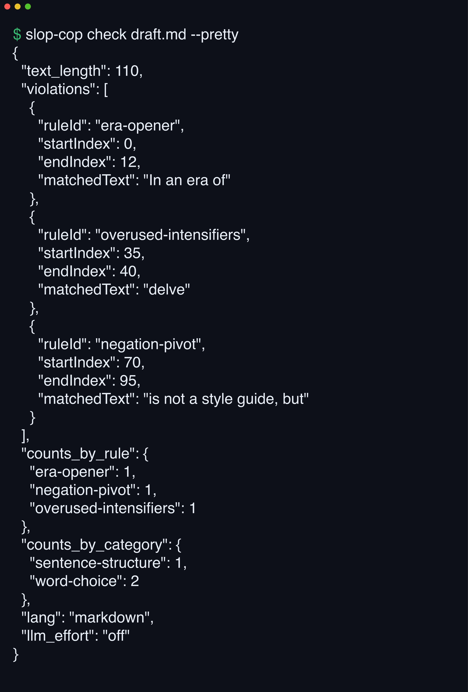

# 

**Never ship 'delve' again.** slop-cop reads your agent's prose with 48 detectors and returns a JSON rap sheet the agent revises against, in CI, pre-commit, or inline.

[](https://github.com/yasyf/slop-cop/actions/workflows/ci.yml)
[](https://github.com/yasyf/slop-cop/releases/latest)
[](LICENSE)

## Get started

```bash
brew install yasyf/tap/slop-cop
slop-cop check draft.md --pretty
```



Driving with an agent? Paste this:

```
/plugin marketplace add yasyf/slop-cop
/plugin install slop-cop@slop-cop
```

<details>
<summary>No plugin support? Paste this instead.</summary>

```text
Install slop-cop with `brew install yasyf/tap/slop-cop`. Then run
`slop-cop check README.md --pretty` and revise the file until the
violations array is empty.
```

</details>

---

## Use cases

### Make your agent self-edit before you ever see the draft

You ask for a PR description and get "In today's fast-paced world" back — then you spend the review playing copy editor. Install the plugin and its skill runs this loop on every draft, before the agent replies:

```bash
printf '%s' "$draft" | slop-cop check --lang=markdown -
```

The agent walks the `violations` array, rewrites each `matchedText`, and re-checks until `counts_by_rule` is `{}`. You see the clean revision, never the slop.

### Block era-openers and hedge stacks in CI and pre-commit

Slop merges because nobody wants to be the reviewer who flags tone. Make the machine do it:

```bash
slop-cop check docs/announcement.md | jq -e '.violations == []'
```

`check` always exits 0 and puts the verdict in the JSON; `jq -e` turns the empty `violations` array into the pass/fail bit. The 35 client-side detectors make no network calls, so the gate costs milliseconds.

### Lint only the prose hiding in JSDoc, JSX, and string literals

Your linter has opinions about semicolons and none about the "seamless synergy" in your hero copy:

```bash
slop-cop check src/Hero.tsx
```

tree-sitter masks every non-prose byte before detectors run, so hits land only on comments, string literals, and JSX text — an "In an era of" JSDoc opener and a `negation-pivot` inside a string literal both get flagged, with offsets that index the original file.

## Commands

| Command | What it does |
| --- | --- |
| `check [path\|-]` | Run detectors; emit a JSON violation report. |
| `rewrite [path\|-]` | Rewrite a paragraph via `claude -p`, optionally targeting `--rules`. |
| `rules` | Print the rule catalogue as JSON (`--category`, `--llm-only`). |
| `version` | Print build metadata as JSON. |

Input is the positional argument (`-` or omitted for stdin). Run `slop-cop check --help` for the full flag list, or `slop-cop rules --pretty` for the taxonomy of all 48 rules. Exit codes: `0` success, `2` input/IO error, `3` claude subprocess error, `4` usage error.

## How it works

Built for agents, not humans: no TUI, no highlighting, no prompts — JSON on stdout, diagnostics on stderr. `check` runs 35 instant client-side detectors (regex + structural), then optionally two Claude-backed tiers: sentence (Haiku, 10 more rules) under `--llm` and document (Sonnet, 3 more) under `--llm-deep` — 48 rules total. `--llm-effort` (`off|low|high|auto`) is the underlying control; under a plugin with `claude` reachable, `auto` resolves to `high`, and an unreachable `claude` fails open — the error lands in the report's `llm` field while client-side results still return. The LLM tiers and `rewrite` shell out to the [`claude`](https://docs.claude.com/en/docs/claude-code/overview) CLI, so slop-cop never needs an Anthropic API key; it rides your Claude subscription.

`--lang` (`auto` by extension, or force `text`, `markdown`, `html`, `jsx`, `tsx`, `ts`, `js`) parses the input and masks non-prose bytes before detectors run. Masking preserves length and newline offsets, so violation offsets index the original input. Add `--lines 50:80` to report only violations beginning in an edited range while still scanning the whole document for context.

> [!WARNING]
> `startIndex` / `endIndex` are UTF-8 byte offsets, not UTF-16 code units — account for that when slicing in JavaScript or Java.

## The agent plugin

The [`slop-cop-prose`](skills/slop-cop-prose/SKILL.md) skill triggers whenever you ask the agent to write, revise, or polish prose, and keeps the loop silent: the agent never announces it. A [`/slop-cop-check`](commands/slop-cop-check.md) command runs a one-off report without rewriting anything.

<details>
<summary>Claude Code</summary>

Install with the two `/plugin` commands under [Get started](#get-started). On the first draft, the skill runs [`scripts/install-binary.sh`](scripts/install-binary.sh) (`.ps1` on Windows) to download the prebuilt binary for your platform from the rolling [`latest`](https://github.com/yasyf/slop-cop/releases/latest) release; no Go toolchain required. Verify end-to-end with [`scripts/test-plugin.sh`](scripts/test-plugin.sh).

</details>

<details>
<summary>Cursor</summary>

Open the Plugins panel and install from Git URL `https://github.com/yasyf/slop-cop`. The same skill and first-run bootstrap apply, keyed off `$CURSOR_PLUGIN_ROOT`.

</details>

---

The Go source is licensed under [MIT](LICENSE). The rule taxonomy, detectors, word lists, and prompts derive from [awnist/slop-cop](https://github.com/awnist/slop-cop) by [@awnist](https://github.com/awnist), which carried no licence at port time — see [NOTICE](NOTICE) before use beyond personal. Original rule sources: [LLM_PROSE_TELLS.md](https://git.eeqj.de/sneak/prompts/src/branch/main/prompts/LLM_PROSE_TELLS.md) (MIT, © sneak), [Wikipedia: Signs of AI writing](https://en.wikipedia.org/wiki/Wikipedia:Signs_of_AI_writing) (CC BY-SA 4.0), [tropes.md](https://tropes.fyi/tropes-md).
